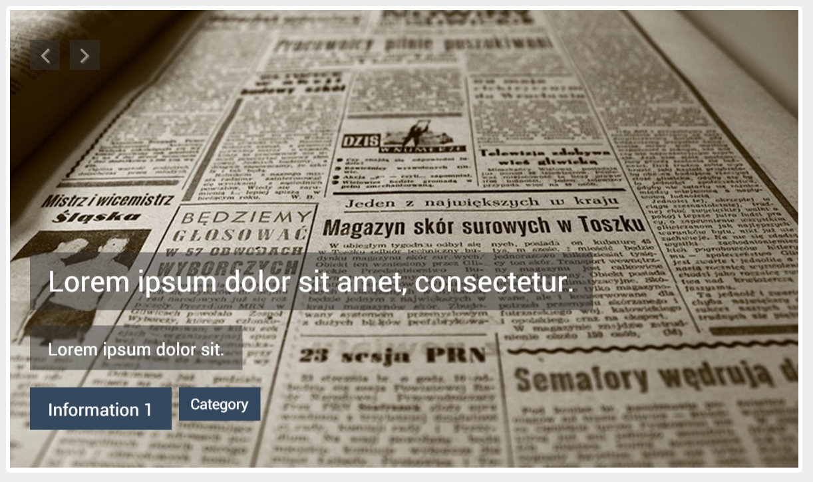

# CSS Animated Flexslider

<!-- BADGES/ -->

  

  

 

  

  

  

  

  

  

 

  
  
  

<!-- /BADGES -->

Flexslider is an animated CSS slider. This is an easy to use slider, where one 
can showcase the image gallery and content on a slider. The navigation includes automatic transitions, or 
next and previous buttons. Its usage may vary from a image slider, banner, carousel or content presenter. This was developed using [HTML](http://www.w3schools.com/html/), [CSS](http://www.w3schools.com/css/) and [JavaScript](http://www.w3schools.com/js/), and it is mostly customizable, from size, font, and all the different time durations.

The Flexslider includes a dedicated folder for the [Image Source](https://github.com/CalliTechDev/css-animated-flexslider/tree/master/img) and for the [Assets](https://github.com/CalliTechDev/css-animated-flexslider/tree/master/img).

**QR CODE:**

### Feature List

- Customizeable slider, where mostly everything can be tuned to the customer's need.

- Smooth performance.

- Easily adaptable to any website.

- Custom Fade in and out times.

- Editable Slider direction.

- Supports a fixed background.

- Easily adaptable font size and type.

- Include 2 Months of support by CalliTech.

### Project Information

##### Test Page

Please visit ou [Test Page](http://caf.calli.tech/) and see the project working:

  

##### Date

11/01/2016

##### Authors

Francisco Maria Calisto ([FMCalisto](https://github.com/FMCalisto))

##### Editors

Inês França Martins

Bruno Cardoso ([bdcardoso](https://github.com/bdcardoso))

#### License

For more details about our License agreement please read the [LICENSE](https://github.com/CalliTechDev/css-animated-flexslider/blob/master/LICENSE.md).
